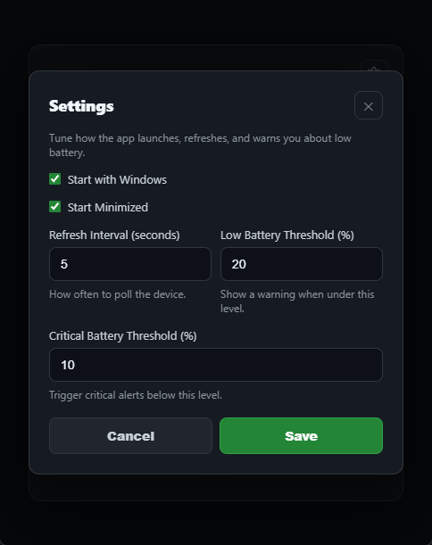

<div align="center">

# 🖱️ Glorious Mouse Battery Monitor

**A lightweight system tray application for monitoring battery levels of Glorious wireless gaming mice**

[](https://go.dev/)
[](LICENSE)
[](https://www.microsoft.com/windows)
[](https://www.buymeacoffee.com/gloriousbattery)

[Features](#-features) • [Installation](#-installation) • [Usage](#-usage) • [Supported Devices](#-supported-devices) • [Building](#-building-from-source)

</div>

---

## ✨ Features

- 🎯 **System Tray Integration** - Runs quietly in the background with battery icon
- 🔋 **Real-time Monitoring** - Updates battery level every 5 seconds
- 📅 **Charge History** - Tracks last charge time and level
- 🎨 **Modern UI** - Clean, dark-themed interface with smooth animations
- 🔄 **Auto-reconnect** - Automatically detects when mouse is plugged/unplugged
- ⚡ **Charging Detection** - Shows charging status with visual indicators
- 💾 **Lightweight** - Low resource usage (app ~10MB, WebView2 runtime ~50-100MB)

## 📸 Screenshots

<div align="center">

### Main Interface


### Settings Page


</div>

## 🚀 Installation

### Download Pre-built Binary

1. Download the latest `GloriousBatteryMonitor.exe` from [Releases](../../releases)
2. Run the executable - no installation required!
3. The app will appear in your system tray

### Requirements

- Windows 10/11 (64-bit)
- WebView2 Runtime (usually pre-installed on Windows 11)
- Glorious wireless gaming mouse

## 📖 Usage

### Running the Application

Simply double-click `GloriousBatteryMonitor.exe` to start the application.

### System Tray Controls

- **Left Click** - Show/hide the main window
- **Right Click** - Open context menu
  - Battery status display
  - Show Window
  - Quit

### Window Behavior

- Closing the window minimizes to system tray (app keeps running)
- Use "Quit" from tray menu to fully exit

## 🖱️ Supported Devices

> **Note:** Only tested with **Model D Wireless**. Other models should work but are untested.

| Mouse Model | Wired | Wireless | Tested |
|------------|-------|----------|--------|
| Model O | ✅ | ✅ | ❌ |
| Model O- | ✅ | ✅ | ❌ |
| Model O Pro | ✅ | ✅ | ❌ |
| Model O2 | ✅ | ✅ | ❌ |
| Model D | ✅ | ✅ | ✅ |
| Model D- | ✅ | ✅ | ❌ |
| Model D2 | ✅ | ✅ | ❌ |
| Model I | ✅ | ✅ | ❌ |
| Model I2 | ✅ | ✅ | ❌ |

**Vendor ID:** `0x258a` (Glorious LLC)

<details>
<summary>View Product IDs</summary>

```
Model O:      0x2011 (Wired), 0x2013 (Wireless)
Model O-:     0x2019 (Wired), 0x2024 (Wireless)
Model O Pro:  0x2017 (Wired), 0x2018 (Wireless)
Model O2:     0x2009 (Wired), 0x200b (Wireless)
Model D:      0x2012 (Wired), 0x2023 (Wireless)
Model D-:     0x2015 (Wired), 0x2025 (Wireless)
Model D2:     0x2031 (Wired), 0x2033 (Wireless)
Model I:      0x2036 (Wired), 0x2046 (Wireless)
Model I2:     0x2014 (Wired), 0x2016 (Wireless)
```

</details>

## 🛠️ Building from Source

### Prerequisites

- [Go 1.21+](https://go.dev/dl/)
- Windows 10/11
- Git

### Build Steps

```bash
# Clone the repository
git clone https://github.com/yourusername/GloriousMouseBattery.git
cd GloriousMouseBattery

# Download dependencies
go mod download

# Build the executable
go build -ldflags -H=windowsgui -o GloriousBatteryMonitor.exe

# Run
./GloriousBatteryMonitor.exe
```

### Dependencies

- [go-webview2](https://github.com/jchv/go-webview2) - WebView2 bindings for Go
- [go-hid](https://github.com/sstallion/go-hid) - HID device communication
- [win](https://github.com/lxn/win) - Windows API bindings

## 🏗️ Project Structure

```
GloriousMouseBattery/
├── main.go              # Main application logic, HID communication, system tray
├── ui.html              # Embedded web UI (HTML/CSS/JavaScript)
├── go.mod               # Go module dependencies
├── go.sum               # Dependency checksums
├── README.md            # This file
├── LICENSE              # MIT License
└── .gitignore           # Git ignore rules
```

## 🔧 Technical Details

### Battery Protocol

The application communicates with Glorious mice using HID Feature Reports:

```go
Command:  {0x00, 0x00, 0x00, 0x02, 0x02, 0x00, 0x83}
Response: inputReport[6] == 0x83 (valid response)
          inputReport[8] = battery level (0-100)
          inputReport[7] = charging status (1 = charging)
```

### Architecture

- **Backend**: Go with native Windows API calls
- **Frontend**: HTML/CSS/JavaScript served via embedded HTTP server
- **Communication**: Server-Sent Events (SSE) for real-time updates
- **System Tray**: Custom 32-bit ARGB icons with transparency

## 🙏 Acknowledgments

- **Reference Project**: [GloriousBatteryMonitor (C#)](https://github.com/Cruxial0/GloriousBatteryMonitor) - Used as reference for HID protocol implementation in `main.go`

## 📝 License

This project is licensed under the MIT License - see the [LICENSE](LICENSE) file for details.

## 🤝 Contributing

Contributions are welcome! Please feel free to submit a Pull Request.

1. Fork the repository
2. Create your feature branch (`git checkout -b feature/AmazingFeature`)
3. Commit your changes (`git commit -m 'Add some AmazingFeature'`)
4. Push to the branch (`git push origin feature/AmazingFeature`)
5. Open a Pull Request

## 🚀 Releasing

Releases are automated via GitHub Actions. To create a new release:

```bash
git tag v1.0.0
git push origin v1.0.0
```

The workflow will automatically build and publish the release with the executable.

## ⚠️ Troubleshooting

### Antivirus False Positives

Some antivirus software (Bitdefender, etc.) may flag the application as suspicious due to WebView2's crash reporting system (Crashpad). This is a **false positive**.

**Solutions:**
1. **Add to antivirus exclusions**: Whitelist `GloriousBatteryMonitor.exe` and `%APPDATA%\GloriousBatteryMonitor\`
2. **Submit false positive report**: Report to your antivirus vendor
3. **Verify file integrity**: Check the SHA256 hash matches the release

**Why this happens:** Unsigned executables using WebView2 can trigger heuristic detection.

### High Memory Usage

The app itself uses ~10MB RAM, but Microsoft Edge WebView2 runtime (required for the UI) uses an additional 50-100MB. This is normal for Chromium-based UIs.

## 📧 Support

If you encounter any issues or have questions:

- Open an [Issue](../../issues)
- Check existing issues for solutions

---


⭐ Star this repo if you find it useful!

</div>
